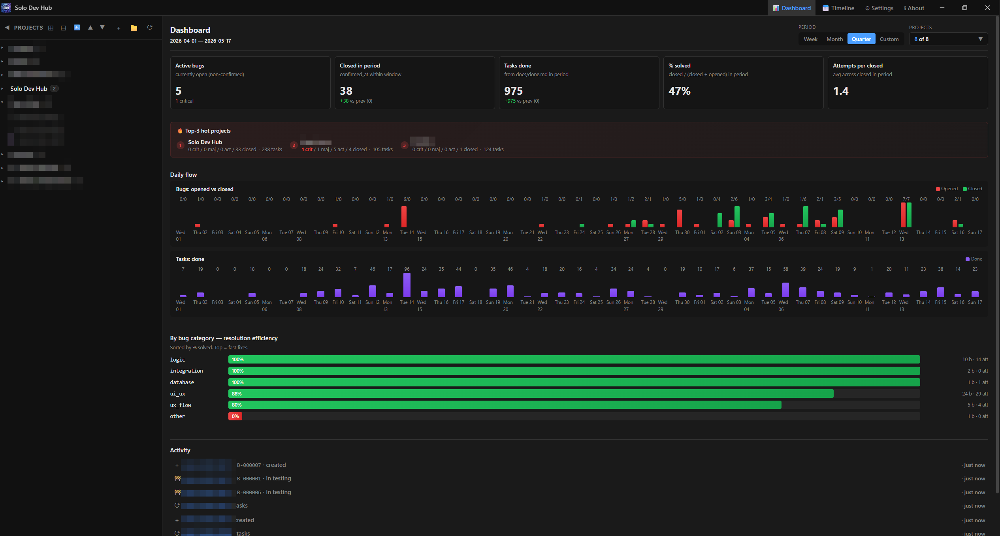
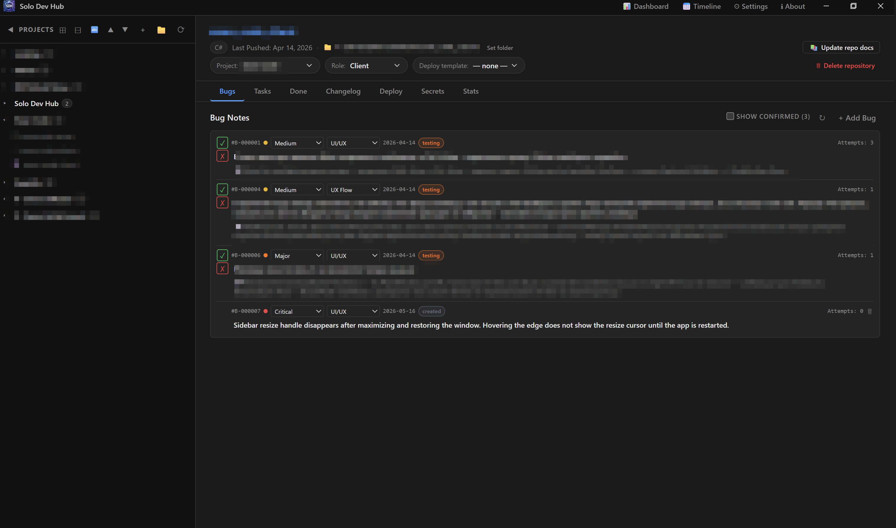
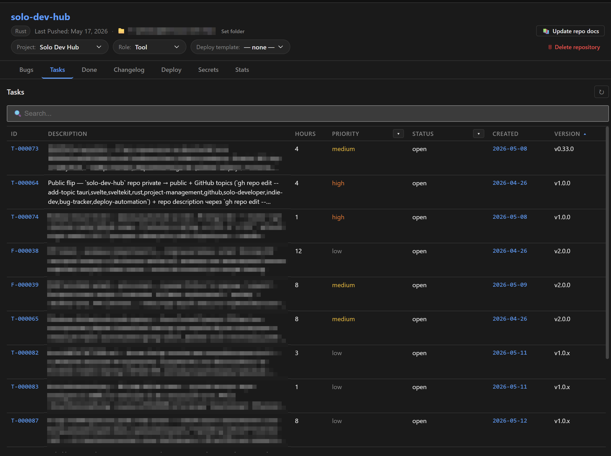
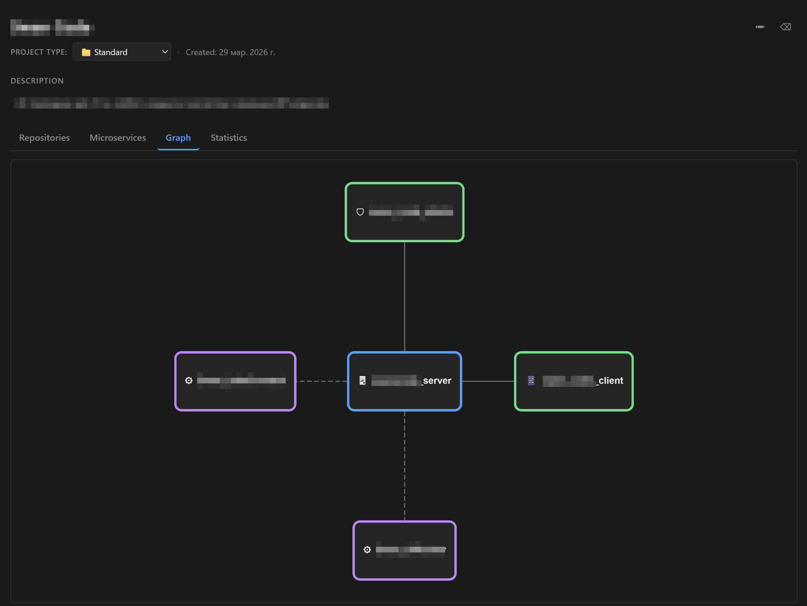
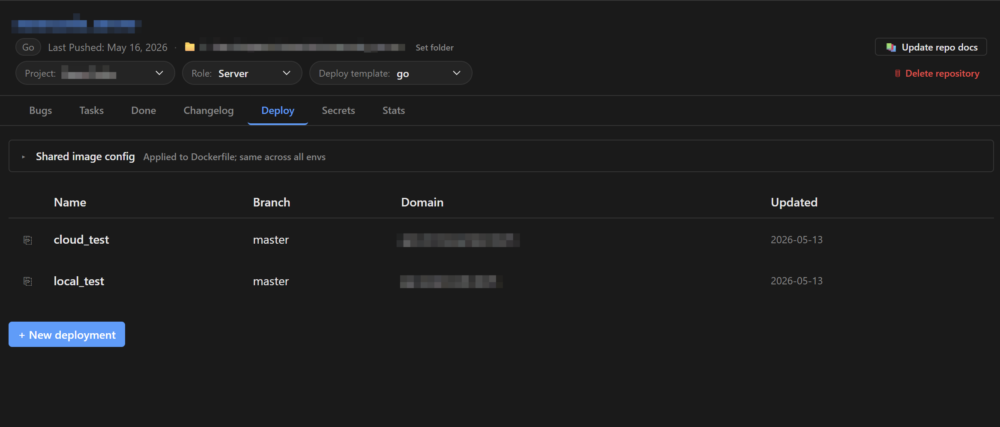
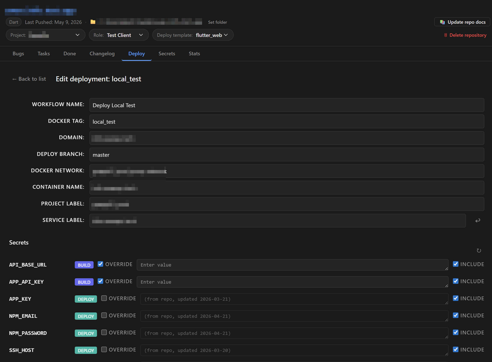
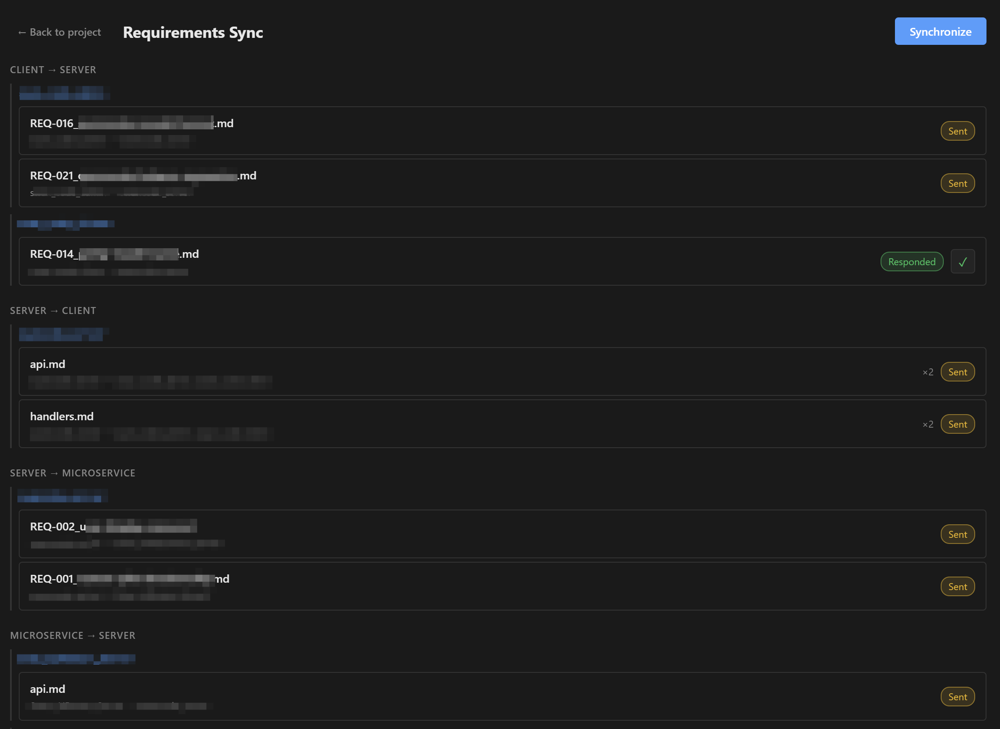
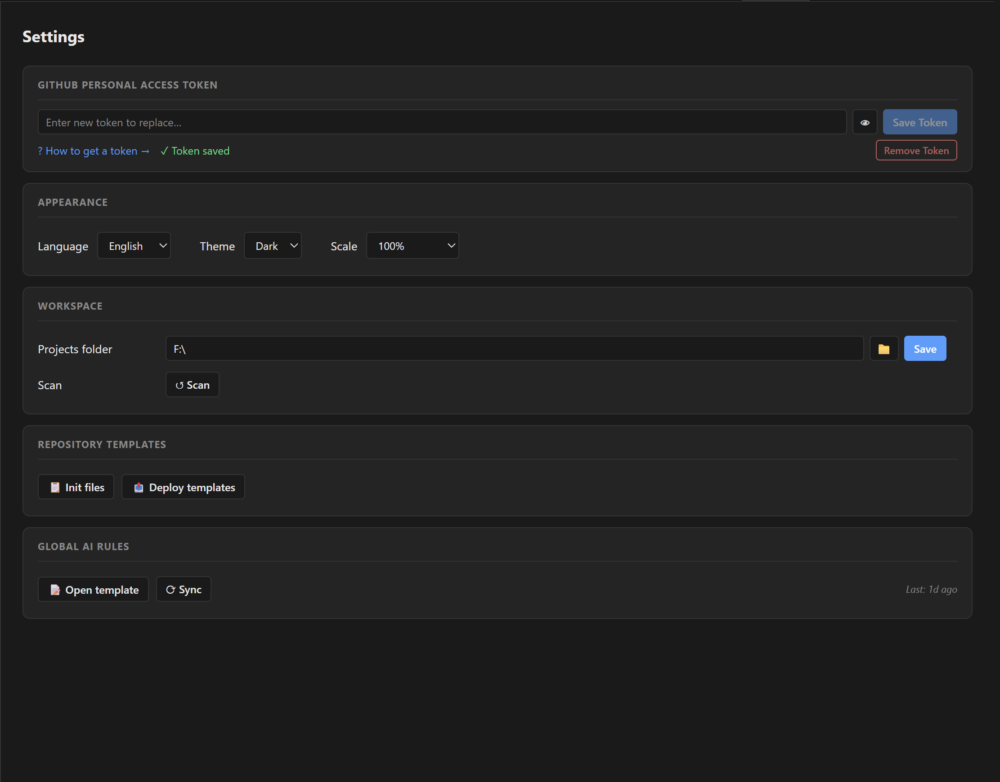

# Solo Dev Hub

> 🇷🇺 Русская версия — [README.ru.md](README.ru.md)

**Solo developer's portfolio cockpit. Bugs, requirements, deploy — all in markdown.**

Managing 10 GitHub repos as one person hits friction GitHub itself doesn't solve: bugs scattered across per-repo Issues, no portfolio-wide overview, multi-repo features (client + server + microservice) demand mental coordination, deploy automation gets hand-rolled in every new project. And the moment you delegate a bug fix to an AI agent, "the agent said it's done, I forgot to verify" silently becomes the failure mode.

Solo Dev Hub is a single-window desktop app that organizes your portfolio, **locks every bug into a verifiable AI-agent workflow**, tracks tasks in commit-able Markdown, syncs requirements between repos, and bundles deploy automation — all under one roof.



## Why?

Built for solo developers, indie hackers, and freelancers running 5+ active GitHub repos who don't want to:

- Pay for team-tier project-management SaaS (Linear / Jira) for one person
- Use GitHub Issues across N repos and lose any portfolio-wide view
- Hand-roll deploy YAML / Dockerfile in every new project
- Lose track of which repo has the most active bugs this week

**AI-ready by design.** Bugs, tasks, requirements, project metadata, and CLAUDE.md sections all live as Markdown inside your repos. Every AI assistant (Claude, ChatGPT, Copilot) reads your entire portfolio context without an API integration — `git clone` is the integration.

## Features

- **AI-agent bug closure with a safety net** — the bug status workflow (`created` → `in-progress` → `testing` → `confirmed` / `rejected`) splits roles cleanly: the AI agent takes a bug, applies a fix, moves it to `testing` with a comment describing what it did; **you** verify and click ✓ or ✗. The agent **cannot** edit `description`, `severity`, `category`, or `fix_attempts` — only `status` and `comment` are AI-writable. The attempt counter auto-increments on every `testing` transition, so "how many tries did this take" is honest history, not a self-report. Net effect: no bug falls through the gap between "agent said it's fixed" and "I forgot to check".
- **Portfolio dashboard** — period-filtered KPIs (open / closed / fix rate / attempts per period), top-3 hot projects, daily bugs/tasks flow charts, category efficiency bars. See your portfolio at a glance.
- **Markdown bugs** — every bug lives in `docs/bug-reports.md` of the affected repo. SQLite is the source-of-truth, the MD file is a 2-way-synced LLM-readable view. Severity, category, append-only event log per bug.
- **Cross-repo requirements** — `REQ-NNN.md` exchange between client ↔ server ↔ microservice. Sender writes the ask, recipient writes the receipt, the app handles file movement between repos. No GitHub Issues, no email threads.
- **Project graph** — visualize a project as a 1-hop graph: server in the center, repos and connected microservices around it. Click any node to navigate. Built on Cytoscape.
- **Multi-environment deploy** — generate Docker + GitHub Actions deploy pipelines per environment (prod / staging / test / any custom name) with native GitHub Environments integration and per-secret role/scope flags.
- **Deploy report** — portfolio-wide view of every deploy environment across all repos in one screen (domains, branches, image tags, secret counts), grouped by project. Click any row to jump straight to that environment's setup.
- **Secret bundles** — reusable, locally-encrypted sets of secret values (the SSH / DB / npm keys you reuse across servers). Enter them once, then apply to any repo's or deploy environment's GitHub secrets instead of re-typing per repo. AES-256-GCM at rest, key in the OS keyring — no master password.
- **Tasks (todo.md / done.md)** — each repo has an append-only completion log auto-tagged with versions. Universal data grid: filter, sort, persist preferences per tab.
- **Activity timeline** — multi-source events (bugs, tasks, syncs, deploys, repo renames) across the entire portfolio. Date-range / kind / repo / search filters.
- **Templates** — per-language seeds for `.gitignore`, `.gitattributes`, deploy YAML, CLAUDE.md sections. Customize once in the app, sync into every project.
- **PAT in OS keyring** — your GitHub token goes into Windows Credential Manager (OS-level), never SQLite, never `.env`, never a plaintext file.
- **Single .exe, ~11 MB** — Tauri v2 + WebView2. No Electron bloat. No daemon. No telemetry. The only background network call is the update-checker pinging GitHub Releases once on startup; everything else is on your explicit action.













## Tech Stack

- **Framework** — Tauri v2 (Rust backend + WebView2 frontend, single-binary distribution)
- **Frontend** — SvelteKit + Svelte 5 + TypeScript
- **Backend** — Rust: SQLite via `rusqlite`, file I/O for sync, Windows Credential Manager via `keyring`
- **GitHub API** — `@octokit/rest` (called directly from the JS side, never proxied through Rust)
- **Graph** — Cytoscape.js with concentric layout, theme-aware
- **i18n** — Russian (default) + English, ~790 type-safe keys, no runtime dependency
- **Autoupdate** — `tauri-plugin-updater` with Ed25519 signing; production builds via GitHub Actions on `v*` tag push

## Getting started

### Install

> Current builds are **Windows x64 only**. Tauri supports macOS and Linux architecturally; non-Windows builds may appear in the release pipeline by request.

1. Download `solo-dev-hub_<version>_x64-setup.exe` from the [Releases page](https://github.com/SgonnovDmGit/solo-dev-hub/releases)
2. Run the installer.
3. **First launch may show a Windows SmartScreen warning** ("Unrecognized publisher"). Authenticode code-signing is on the v2.0.0 roadmap. Until then: click "More info" → "Run anyway".

### First-time setup

1. **Generate a GitHub Personal Access Token** at [github.com/settings/tokens](https://github.com/settings/tokens) with these scopes:
   - `repo` — full repository access (read your repos, manage Actions secrets)
   - `workflow` — required for the deploy automation
   - `read:user` — read your profile info
2. Open Solo Dev Hub → **Settings** (cog icon) → paste the PAT → save. The token goes into Windows Credential Manager — never on disk in plaintext.
3. **Set your workspace root** — Settings → Workspace. This is the directory under which the app expects your repos to be cloned (e.g. `C:\Users\You\Development\`).
4. Click **🔄 Sync** in the sidebar. The app fetches your repo list from GitHub.
5. **Organize**: drag repos into projects in the sidebar, or click a repo to assign a role (server / client / microservice / landing / tool / etc.).



### Daily flow

- **Sidebar** shows your projects → repos. Click a repo → tabs for Bugs / Tasks / Done / Changelog / Deploy / Secrets / Stats.
- **Add a bug** via "+ Add bug" — instantly committable in `docs/bug-reports.md` (the MD is a view; SQLite is the SoT).
- **Dashboard** (📊 in the sidebar) — portfolio-wide KPIs filtered by period and projects.
- **Timeline** (📅) — chronological event feed across the whole portfolio.
- **Deploy** — click on a deploy-capable repo → Deploy tab → set up environments + secrets → generate Dockerfile + workflow with one click.

## Development

### Prerequisites

- Node.js v18+
- Rust (via [rustup](https://rustup.rs))
- Microsoft C++ Build Tools (Tauri requirement)
- WebView2 Runtime (pre-installed on Windows 11)

### Local

```bash
npm install
npm run tauri dev          # local dev with hot reload
```

### Tests

```bash
cd src-tauri && cargo test --lib   # ~446 Rust tests
npm test                            # vitest frontend (~86 tests)
npm run check                       # svelte-check
```

### Production build

Production releases are built by GitHub Actions on `v*` tag push — never build locally for distribution (unsigned, no `latest.json`):

```bash
git tag -a vX.Y.Z -m "vX.Y.Z"
git push origin master vX.Y.Z
```

The full release runbook (key rotation, CI troubleshooting, hotfix flow) — [docs/RELEASING.md](docs/RELEASING.md).

### AI rules

`CLAUDE.md` (gitignored) carries the in-project AI rules. The app's "Sync to ~/.claude/CLAUDE.md" feature pushes the global section into your user-level Claude Code config. Per-project CLAUDE.md sits in each repo's root.

## Roadmap

- **v1.4.1** *(current — 2026-06-15)* — patch: decomposed the `sync_project` handler out of the command layer into a `sync/project_sync.rs` domain module (zero behavior change), plus a dev-workflow self-heal that auto-frees port 1420 before `tauri dev`.
- **v1.4.0** — internal refactor milestone: split the Rust command layer (`lib.rs` → `commands/`) and the TypeScript bindings (`tauri-commands.ts` → directory), extracted the sidebar resizer into its own component; ships with a secret-bundles screen polish (readable multi-line `SSH_KEY` editing) and a broken-theme fix (2026-06-14).
- **v1.3.0** — reusable encrypted secret bundles (enter SSH / DB / npm values once, apply to any repo's or deploy environment's GitHub secrets), plus a deploy repo-config cross-repo leak fix (2026-06-14).
- **v1.2.0** — portfolio deploy report (all deploy environments in one screen, grouped by project, with drill-down to each), `.gitattributes` managed template, plus dashboard custom date-range and per-repo secrets-draft fixes (2026-06-02).
- **v1.1.0** — verdict-rollback for bugs (↩ reopen button on confirmed/rejected), full-height secrets bulk-paste, unified dialog button labels (2026-05-25).
- **v1.0.0** — public launch (2026-05-18), MIT-licensed open source, frozen-contract era begins.
- **v1.4.1–v1.6** — further internal refactors (decomposing the 570-line `sync_project` handler, UI component splits) + contributor docs (`docs/ARCHITECTURE.md`, SQLite ER-graph).
- **v1.7.0** — in-app multilingual help screen documenting the LLM operating contract.
- **v1.8.0** — cross-platform builds (macOS / Linux).
- **v2.0.0** — Windows Authenticode code signing (removes the SmartScreen warning), read-only API viewer + client/server compatibility matrix, REQ auto-accept with `## Status:` frontmatter.

Full backlog and per-version task lists — [`docs/roadmap.md`](docs/roadmap.md).

## Support development

The app is free and ad-free. If it saves you time, consider supporting development:

- **Boosty** — [boosty.to/sgonnovdm/donate](https://boosty.to/sgonnovdm/donate) (RUB / cards / СБП)
- **TON** — `UQA-0I3SN2vw8F2ZzEoOTXT36-ToF0mu4Yp4_6pVmsR_dI0S`

Or use the in-app About screen — one-click links and copy-to-clipboard for the TON address.

## License

[MIT](LICENSE) © 2026 Sgonnov D.A.

Built with [Tauri](https://tauri.app), [SvelteKit](https://kit.svelte.dev), and AI assistants.
