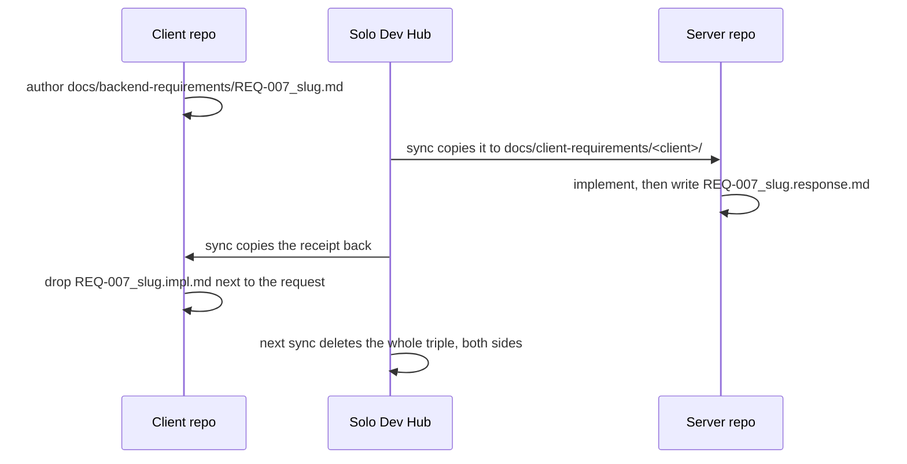

# Architecture

A contributor's map of Solo Dev Hub: what the layers are, why the load-bearing decisions were made the way they were, and where to look when you want the details.

This document is for **people**. `CLAUDE.md` covers the same ground for AI assistants, and the per-feature deep dives live in [`docs/flows/`](flows/). Nothing here is a changelog or a roadmap — see [`Changelog.md`](../Changelog.md) for history.

## The shape of the thing

Solo Dev Hub is a single-window desktop app: a Rust process that owns all state, and a SvelteKit UI rendered in the system WebView. There is no server, no daemon, no background sync service. Everything happens on your machine, against repositories that already live on your disk.

```
┌──────────────────────────────────────────────────────────────┐
│  WebView2 (SvelteKit + Svelte 5 + TypeScript)                │
│                                                              │
│  components/ ── stores/ ── api/tauri-commands/ ── i18n/      │
│                    │              │                          │
│                    │              │        api/github.ts ────┼──▶ GitHub REST
│                    │              │                          │    (@octokit)
└────────────────────┼──────────────┼──────────────────────────┘
                     │              │  Tauri IPC (~111 commands)
┌────────────────────┼──────────────▼──────────────────────────┐
│  Rust (src-tauri/src/)                                       │
│                                                              │
│  commands/  ── thin command layer, one module per domain     │
│      │                                                       │
│      ├── db/       ── SQLite (rusqlite), migrations v1..v28  │
│      ├── sync/     ── cross-repo file sync, MD ↔ DB          │
│      ├── export/   ── Markdown parse / generate              │
│      ├── crypto/   ── AES-256-GCM for secret values          │
│      ├── git_ops   ── system git CLI wrapper                 │
│      └── keyring   ── OS credential store (PAT, data key)    │
└──────────────┬───────────────────┬───────────────────────────┘
               │                   │
        ┌──────▼──────┐     ┌──────▼─────────────────────────┐
        │  SQLite     │     │  Your repositories on disk     │
        │  (app data) │     │  docs/*.md, .gitignore, deploy │
        └─────────────┘     └────────────────────────────────┘
```

The dependency direction is one-way: the UI calls Rust, Rust never calls back into the UI except through command return values and a small number of events. The UI holds no durable state — reload the window and everything comes back from SQLite and disk.

## Layers

### Rust backend (`src-tauri/src/`)

`lib.rs` is deliberately boring: setup, run migrations, seed bundled templates, register commands. Everything else is a domain module.

| Module | Responsibility |
|---|---|
| `commands/` | The IPC surface. One module per domain (`bug`, `repo`, `project`, `sync`, `deploy`, `dashboard`, `templates`, `timeline`, `misc`). Thin — argument shuffling and delegation, no business logic. |
| `db/` | SQLite access, one module per domain, plus `migrations.rs` (the schema's source of truth). |
| `sync/` | The interesting one. Cross-repo file movement, Markdown ↔ DB reconciliation, managed-block rewriting, auto-commit. |
| `export/` | Parsing and generating the Markdown formats (bug reports, todo, done). |
| `crypto/` | AES-256-GCM. Encrypts secret values before they touch SQLite. |
| `git_ops.rs` | Wrapper over the system `git` binary: availability probe, status, `check-ignore`, pathspec-scoped commits. |
| `keyring_store.rs` | The GitHub PAT and the encryption data key, in the OS credential store. |
| `template_render.rs`, `template_meta.rs`, `template_seeder.rs` | Deploy templates: `@@VAR@@` substitution, `meta.json` placeholder metadata, seeding the bundle into SQLite at startup. |

The split into `commands/` + domain modules landed in v1.4.0–v1.4.1; before that `lib.rs` was 3346 lines. If you are looking at a command and wondering where the work happens, it is almost always one call deeper, in `db/` or `sync/`.

### Frontend (`src/`)

| Folder | Responsibility |
|---|---|
| `lib/components/` | ~46 Svelte components. Screens, tabs, dialogs. |
| `lib/stores/` | Svelte stores: `ui`, `projects`, `repos`, `bugs`, `dashboard`, `settings`, `updater`, `autosync`. |
| `lib/api/tauri-commands/` | Typed bindings to the Rust commands, one module per domain. |
| `lib/api/github.ts` | GitHub REST via `@octokit/rest` — called from the browser side directly. |
| `lib/i18n/` | Russian + English, ~850 type-safe keys, plain TypeScript object maps. |
| `lib/types/` | Interfaces per domain, mirroring the Rust `models/`. |

Svelte 5 runes (`$state`, `$derived`, `$effect`) in components; classic `writable`/`derived` in stores.

### Storage

Two stores, with a clean split of what belongs where:

- **SQLite** — everything relational: projects, repositories, the many-to-many microservice links, bugs, tasks, deploy environments, and the append-only event logs that power the dashboard and timeline. 18 tables, no views, schema version 28.

  [`docs/schema/`](schema/) holds the ER diagram and a page per table. **It is generated — never hand-edit it.** `npm run schema:docs` builds a throwaway database by running every migration against an empty file, points [tbls](https://github.com/k1LoW/tbls) at it, and rewrites the folder; regenerate and commit it alongside any schema-changing migration. Table and column descriptions come from the `comments:` block in [`.tbls.yml`](../.tbls.yml), because SQLite has no `COMMENT ON` — that block is the one part you do edit by hand.
- **The OS credential store** — the GitHub PAT and the AES data key. Never SQLite, never `.env`, never a file.
- **Your repositories** — bugs, tasks, requirements and generated config live as Markdown and config files *inside the repos they describe*, so they travel with `git clone`.

## Decisions worth knowing

### Tauri v2, not Electron

The app ships as a single executable (~19 MB as of v1.10.0). The equivalent Electron build starts around 100 MB because it bundles a browser. Tauri uses the WebView already installed on the system, and the backend is Rust rather than Node. For a tool a solo developer installs on their own machine, download size and idle memory are real costs, and the platform-webview quirks are a price we accept in exchange.

The window is drawn with `decorations: false` and a custom titlebar; window controls go through `@tauri-apps/api/window`.

### SQLite, not JSON files

The data is genuinely relational — a repository belongs to one project, a microservice is shared across many, events reference bugs and tasks which reference repositories. Dashboard and timeline queries are aggregations with date filters. Doing that over JSON means hand-rolling joins and holding everything in memory. Migrations also matter: the schema has moved 28 times, and each step needs to run against existing user data.

### Markdown is the interface, SQLite is the source of truth

Bugs live in SQLite, but every repo also has a `docs/bug-reports.md` that mirrors them. This is not redundancy for its own sake — it is what makes the app AI-native without an API integration. Any assistant that can read the repo can read the bug list.

The two-way sync is asymmetric on purpose:

- **Protected fields** (`description`, `severity`, `category`, `fix_attempts`, `created_at`, `id`) are restored from the DB on every reconcile. If an agent edits them in Markdown, the edit is silently reverted.
- **Agent-writable fields** are `status` and `comment` only, plus deleting a row once it is `confirmed` — which doubles as the acknowledgement point in the workflow.
- The attempt counter is incremented **by the app**, on every transition into `testing`. An agent cannot report its own success rate.

That asymmetry is the app's central idea: an AI agent can work the bug list, but it cannot grade its own homework. Details in [`flows/bug-tracking.md`](flows/bug-tracking.md).

Tasks (`todo.md` / `done.md`) use the same pattern with the polarity reversed: the Markdown is canonical and the DB is a mirror rebuilt on each sync, because tasks are edited by hand far more often than bugs are.

### Cross-repo sync copies files; it does not touch git remotes

When a client repo sends a requirement to a server repo, the app **copies the file into the recipient's working tree on disk**. It does not push, pull, or open a PR.

This keeps the app out of your git workflow. Synced files show up as ordinary uncommitted changes that you review and commit like anything else — or, if a repo has an auto-commit branch configured, the app commits them itself in a pathspec-scoped commit authored by `Solo Dev Hub`, touching only the cross-repo doc folders and only when the repo is on the configured branch. Folders you have deliberately gitignored (a local inbox) are skipped, never force-added.

Folder naming has a single source of truth: `Repository::canonical_folder_name()`, the last path segment of the GitHub name. Renames are logged to `repo_renames` / `project_renames` and replayed on the counterparty's filesystem during the sync preamble; replay is idempotent through filesystem checks rather than an "applied" flag.

### Secrets are encrypted at rest

Deploy secret values and secret bundles are stored as ciphertext + nonce (AES-256-GCM), with the data key in the OS keyring next to the PAT. There is no master password and no plaintext value anywhere in the database.

### Git through the CLI

`git_ops.rs` spawns the system `git` rather than linking a library — it matches what the user's own tooling does, including their config and credential helpers. On Windows every spawn sets `CREATE_NO_WINDOW`; without it a GUI build flashes a console window on each call, which is invisible in `cargo run` and very visible in a release build.

### GitHub API from the frontend

Calls to GitHub go out from the JavaScript side via `@octokit/rest`, never proxied through Rust. Proxying would buy nothing and would mean re-implementing pagination, rate-limit handling and error shapes in a second language.

## The cross-repo requirement flow

The one piece of behavior that spans repositories, and the one most worth understanding before you touch `sync/`.

A **requirement** is a message with a receipt. The sender owns the message, the recipient owns the receipt, and the pair is torn down together when the work is done.



Two ways to close a pair: the ✓ button in the app, or dropping an `.impl.md` file next to the request and letting one sync tear everything down. Either way the teardown removes the base request **first**, then the response, then the impl marker — which makes the deletion order a diagnostic: a leftover base file with the response gone cannot have been produced by the app.

The base request is the sender's source of truth. As long as it exists in the sender's outgoing folder, every sync re-copies it to the recipient. Deleting the response and impl by hand while leaving the base behind therefore resurrects a finished requirement as an open one — which is why the file-level rules are strict about never hand-deleting half a triple.

Full detail, including the microservice triangle and announcement channels: [`flows/requirements-sync.md`](flows/requirements-sync.md), [`flows/microservice-server-sync.md`](flows/microservice-server-sync.md), [`flows/cross-repo-announcements.md`](flows/cross-repo-announcements.md).

## Where to look next

| Topic | Document |
|---|---|
| Database schema, ER diagram (generated) | [`schema/`](schema/) |
| Contributor-facing layer map (this file) | [`ARCHITECTURE.md`](ARCHITECTURE.md) |
| Bug workflow and MD↔DB reconcile | [`flows/bug-tracking.md`](flows/bug-tracking.md) |
| Cross-repo requirements | [`flows/requirements-sync.md`](flows/requirements-sync.md) |
| Microservice ↔ server triangle | [`flows/microservice-server-sync.md`](flows/microservice-server-sync.md) |
| Announcement channel | [`flows/cross-repo-announcements.md`](flows/cross-repo-announcements.md) |
| Deploy generation | [`flows/deploy-flow.md`](flows/deploy-flow.md) |
| GitHub secrets | [`flows/secrets-management.md`](flows/secrets-management.md) |
| Dashboard aggregation | [`flows/dashboard.md`](flows/dashboard.md) |
| Templates and seeding | [`flows/templates-system.md`](flows/templates-system.md) |
| Files the app writes into a repo | [`flows/repo-auto-files.md`](flows/repo-auto-files.md) |
| Repository deletion semantics | [`flows/repository-deletion.md`](flows/repository-deletion.md) |
| Manual ordering (drag to reorder) | [`flows/manual-ordering.md`](flows/manual-ordering.md) |
| API contract sync | [`flows/api-handlers-sync.md`](flows/api-handlers-sync.md) |
| Markdown file formats | [`formats/`](formats/) |
| Release process | [`RELEASING.md`](RELEASING.md) |

## Building and testing

```bash
npm install
npm run tauri dev                    # dev, hot reload

cd src-tauri && cargo test --lib     # 459 Rust tests
npx vitest run                       # 86 frontend tests (from repo root)
npm run check                        # svelte-check

npm run schema:docs                  # regenerate docs/schema/ after a migration
npm run tauri build -- --no-bundle   # local release .exe, no installer, no signing
```

`npm run schema:docs` needs [tbls](https://github.com/k1LoW/tbls) and Graphviz. Install tbls with **`CGO_ENABLED=1`** — the default `go install` on a machine without a C compiler produces a binary whose SQLite driver is a stub, and the script fails with *"go-sqlite3 requires cgo to work"*.

`npm run tauri build` without `--no-bundle` is CI-only — it needs the updater signing key, which lives in a GitHub Actions secret and nowhere on disk.
