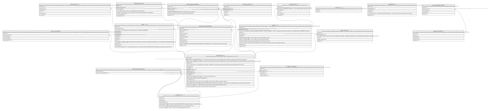

# Solo Dev Hub — SQLite schema

## Tables

| Name                                              | Columns | Comment                                                                                                                                                                                                                                                                                                     | Type  |
| ------------------------------------------------- | ------- | ----------------------------------------------------------------------------------------------------------------------------------------------------------------------------------------------------------------------------------------------------------------------------------------------------------- | ----- |
| [projects](projects.md)                           | 7       | A portfolio project — the unit that groups repositories and can consume microservice projects.                                                                                                                                                                                                              | table |
| [settings](settings.md)                           | 2       | Flat key/value application settings. Never holds secrets — the GitHub PAT and the encryption data key live in the OS credential store.                                                                                                                                                                      | table |
| [templates](templates.md)                         | 6       | Deploy/scaffold template files per language key, including each stack's meta.json (v25 reads it to decide which placeholders are repo-scope).                                                                                                                                                               | table |
| [project_microservices](project_microservices.md) | 2       | Many-to-many link between a parent project and a consumed microservice project. Rebuilt in v12 — before that it linked a project to a repository. Composite PK plus CHECK(project_id != microservice_project_id), so a project cannot consume itself.                                                       | table |
| [repositories](repositories.md)                   | 18      | A repository belonging to at most one project. May be GitHub-backed or local-only.                                                                                                                                                                                                                          | table |
| [repo_renames](repo_renames.md)                   | 5       | Append-only log of repository renames, written when a known github_id shows up under a new github_name. The sync preamble replays every entry to rename cross-repo folders on the counterparty's disk. There is deliberately no applied_at column — idempotency comes from filesystem checks, not DB state. | table |
| [bugs](bugs.md)                                   | 13      | Source of truth for bug reports. docs/bug-reports.md in each repo is a generated, LLM-facing view of this table — protected fields are restored from here on every reconcile.                                                                                                                               | table |
| [bug_events](bug_events.md)                       | 6       | Append-only bug lifecycle log (v19), so attempts-per-period metrics are computed from events rather than a running counter. Invariant: the count of 'entered_testing' events for a bug equals bugs.fix_attempts.                                                                                            | table |
| [deploy_environments](deploy_environments.md)     | 11      | One deploy environment (prod / staging / any custom name) for a repository; 1:N per repo since v20, which replaced the single deploy_manifests row.                                                                                                                                                         | table |
| [deploy_secrets](deploy_secrets.md)               | 7       | Per-environment per-secret flags: which role the secret plays and whether it is included or overridden. Values are NOT stored here.                                                                                                                                                                         | table |
| [tasks](tasks.md)                                 | 12      | Mirror of docs/todo.md and docs/done.md. Polarity is the reverse of bugs — here the Markdown is canonical and this table is rebuilt from it on each sync, because tasks are hand-edited far more often than bugs.                                                                                           | table |
| [task_events](task_events.md)                     | 6       | Append-only task lifecycle log, the task-side twin of bug_events.                                                                                                                                                                                                                                           | table |
| [deploy_events](deploy_events.md)                 | 6       | Log of deploy operations (template render, GitHub secret set/delete). deploy_env_id is nullable so repo-level actions can be recorded too.                                                                                                                                                                  | table |
| [project_renames](project_renames.md)             | 5       | Project-level twin of repo_renames (v24). Needed because microservice-api/<name>/ folders on the parent-server side are keyed by project name, which repo_renames does not cover.                                                                                                                           | table |
| [sync_events](sync_events.md)                     | 6       | Log of sync operations, feeding the timeline. repository_id is nullable — a NULL row is a portfolio-wide sync rather than a per-repo one.                                                                                                                                                                   | table |
| [secret_bundles](secret_bundles.md)               | 5       | v26 — a named, reusable set of secret values (the SSH / DB / npm keys you apply across repos). Portfolio-wide: deliberately not tied to a repository.                                                                                                                                                       | table |
| [secret_bundle_items](secret_bundle_items.md)     | 5       | One secret inside a bundle, encrypted with the same key and cipher as deploy_secret_values.                                                                                                                                                                                                                 | table |
| [deploy_secret_values](deploy_secret_values.md)   | 6       | v27 — persisted deploy secret values, encrypted at rest with AES-256-GCM. The data key lives in the OS keyring; no plaintext value is ever stored.                                                                                                                                                          | table |

## Relations

---

> Generated by [tbls](https://github.com/k1LoW/tbls)
