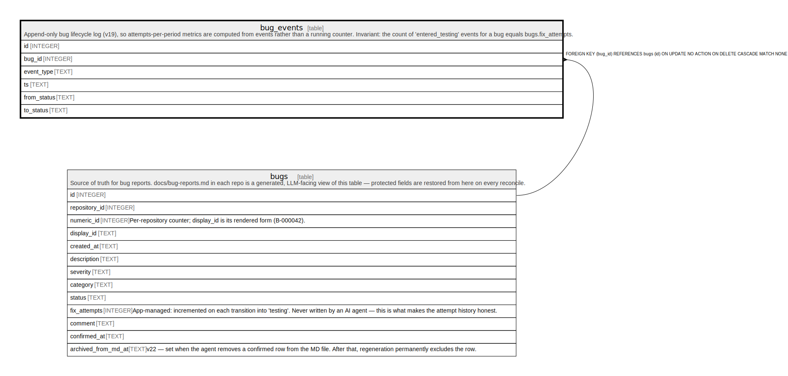

# bug_events

## Description

Append-only bug lifecycle log (v19), so attempts-per-period metrics are computed from events rather than a running counter. Invariant: the count of 'entered_testing' events for a bug equals bugs.fix_attempts.

<details>
<summary><strong>Table Definition</strong></summary>

```sql
CREATE TABLE bug_events (
             id INTEGER PRIMARY KEY AUTOINCREMENT,
             bug_id INTEGER NOT NULL REFERENCES bugs(id) ON DELETE CASCADE,
             event_type TEXT NOT NULL CHECK(event_type IN (
                 'created','taken','entered_testing','confirmed','rejected','reopened'
             )),
             ts TEXT NOT NULL,
             from_status TEXT,
             to_status TEXT
         )
```

</details>

## Columns

| Name        | Type    | Default | Nullable | Children | Parents         | Comment |
| ----------- | ------- | ------- | -------- | -------- | --------------- | ------- |
| id          | INTEGER |         | true     |          |                 |         |
| bug_id      | INTEGER |         | false    |          | [bugs](bugs.md) |         |
| event_type  | TEXT    |         | false    |          |                 |         |
| ts          | TEXT    |         | false    |          |                 |         |
| from_status | TEXT    |         | true     |          |                 |         |
| to_status   | TEXT    |         | true     |          |                 |         |

## Constraints

| Name                  | Type        | Definition                                                                                     |
| --------------------- | ----------- | ---------------------------------------------------------------------------------------------- |
| id                    | PRIMARY KEY | PRIMARY KEY (id)                                                                               |
| - (Foreign key ID: 0) | FOREIGN KEY | FOREIGN KEY (bug_id) REFERENCES bugs (id) ON UPDATE NO ACTION ON DELETE CASCADE MATCH NONE     |
| -                     | CHECK       | CHECK(event_type IN ( 'created','taken','entered_testing','confirmed','rejected','reopened' )) |

## Indexes

| Name                   | Definition                                                        |
| ---------------------- | ----------------------------------------------------------------- |
| idx_bug_events_type_ts | CREATE INDEX idx_bug_events_type_ts ON bug_events(event_type, ts) |
| idx_bug_events_ts      | CREATE INDEX idx_bug_events_ts ON bug_events(ts)                  |
| idx_bug_events_bug     | CREATE INDEX idx_bug_events_bug ON bug_events(bug_id)             |

## Relations



---

> Generated by [tbls](https://github.com/k1LoW/tbls)
