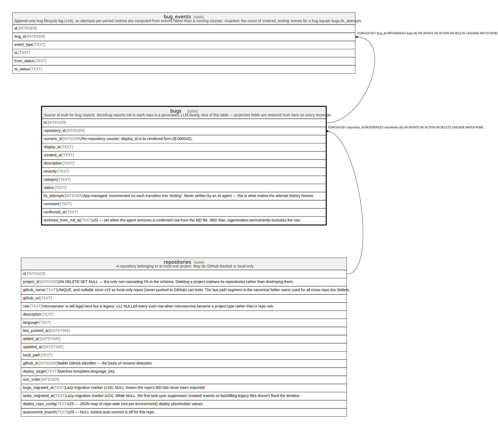

# bugs

## Description

Source of truth for bug reports. docs/bug-reports.md in each repo is a generated, LLM-facing view of this table — protected fields are restored from here on every reconcile.

<details>
<summary><strong>Table Definition</strong></summary>

```sql
CREATE TABLE bugs (
            id INTEGER PRIMARY KEY AUTOINCREMENT,
            repository_id INTEGER NOT NULL REFERENCES repositories(id) ON DELETE CASCADE,
            numeric_id INTEGER NOT NULL,
            display_id TEXT NOT NULL,
            created_at TEXT NOT NULL,
            description TEXT NOT NULL,
            severity TEXT NOT NULL CHECK(severity IN ('critical','major','medium','minor')),
            category TEXT NOT NULL CHECK(category IN ('ui_ux','ux_flow','logic','auth','database','performance','security','integration','other')),
            status TEXT NOT NULL CHECK(status IN ('created','in-progress','testing','rejected','confirmed')),
            fix_attempts INTEGER NOT NULL DEFAULT 0,
            comment TEXT,
            confirmed_at TEXT, archived_from_md_at TEXT,
            UNIQUE(repository_id, numeric_id)
         )
```

</details>

## Columns

| Name                | Type    | Default | Nullable | Children                    | Parents                         | Comment                                                                                                                                   |
| ------------------- | ------- | ------- | -------- | --------------------------- | ------------------------------- | ----------------------------------------------------------------------------------------------------------------------------------------- |
| id                  | INTEGER |         | true     | [bug_events](bug_events.md) |                                 |                                                                                                                                           |
| repository_id       | INTEGER |         | false    |                             | [repositories](repositories.md) |                                                                                                                                           |
| numeric_id          | INTEGER |         | false    |                             |                                 | Per-repository counter; display_id is its rendered form (B-000042).                                                                       |
| display_id          | TEXT    |         | false    |                             |                                 |                                                                                                                                           |
| created_at          | TEXT    |         | false    |                             |                                 |                                                                                                                                           |
| description         | TEXT    |         | false    |                             |                                 |                                                                                                                                           |
| severity            | TEXT    |         | false    |                             |                                 |                                                                                                                                           |
| category            | TEXT    |         | false    |                             |                                 |                                                                                                                                           |
| status              | TEXT    |         | false    |                             |                                 |                                                                                                                                           |
| fix_attempts        | INTEGER | 0       | false    |                             |                                 | App-managed: incremented on each transition into 'testing'. Never written by an AI agent — this is what makes the attempt history honest. |
| comment             | TEXT    |         | true     |                             |                                 |                                                                                                                                           |
| confirmed_at        | TEXT    |         | true     |                             |                                 |                                                                                                                                           |
| archived_from_md_at | TEXT    |         | true     |                             |                                 | v22 — set when the agent removes a confirmed row from the MD file. After that, regeneration permanently excludes the row.                 |

## Constraints

| Name                    | Type        | Definition                                                                                                      |
| ----------------------- | ----------- | --------------------------------------------------------------------------------------------------------------- |
| id                      | PRIMARY KEY | PRIMARY KEY (id)                                                                                                |
| - (Foreign key ID: 0)   | FOREIGN KEY | FOREIGN KEY (repository_id) REFERENCES repositories (id) ON UPDATE NO ACTION ON DELETE CASCADE MATCH NONE       |
| sqlite_autoindex_bugs_1 | UNIQUE      | UNIQUE (repository_id, numeric_id)                                                                              |
| -                       | CHECK       | CHECK(severity IN ('critical','major','medium','minor'))                                                        |
| -                       | CHECK       | CHECK(category IN ('ui_ux','ux_flow','logic','auth','database','performance','security','integration','other')) |
| -                       | CHECK       | CHECK(status IN ('created','in-progress','testing','rejected','confirmed'))                                     |

## Indexes

| Name                    | Definition                                                                                                |
| ----------------------- | --------------------------------------------------------------------------------------------------------- |
| idx_bugs_confirmed_at   | CREATE INDEX idx_bugs_confirmed_at ON bugs(confirmed_at)<br />             WHERE confirmed_at IS NOT NULL |
| idx_bugs_repo_date      | CREATE INDEX idx_bugs_repo_date ON bugs(repository_id, created_at)                                        |
| idx_bugs_status         | CREATE INDEX idx_bugs_status ON bugs(status)                                                              |
| idx_bugs_repo           | CREATE INDEX idx_bugs_repo ON bugs(repository_id)                                                         |
| sqlite_autoindex_bugs_1 | UNIQUE (repository_id, numeric_id)                                                                        |

## Relations



---

> Generated by [tbls](https://github.com/k1LoW/tbls)
