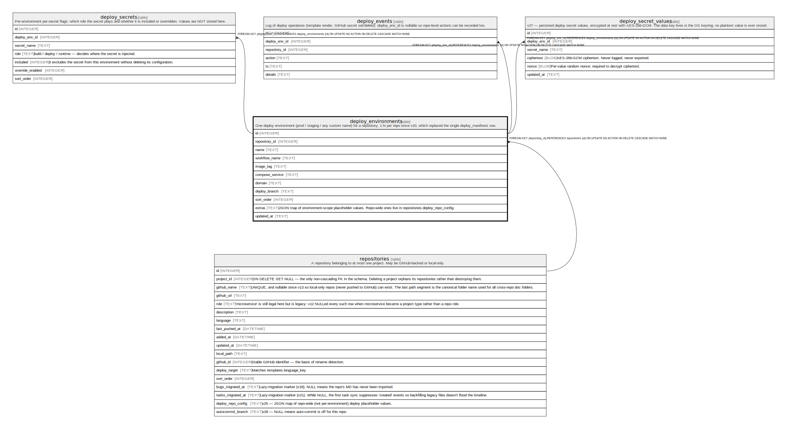

# deploy_environments

## Description

One deploy environment (prod / staging / any custom name) for a repository; 1:N per repo since v20, which replaced the single deploy_manifests row.

<details>
<summary><strong>Table Definition</strong></summary>

```sql
CREATE TABLE deploy_environments (
            id INTEGER PRIMARY KEY AUTOINCREMENT,
            repository_id INTEGER NOT NULL REFERENCES repositories(id) ON DELETE CASCADE,
            name TEXT NOT NULL,
            workflow_name TEXT NOT NULL,
            image_tag TEXT NOT NULL,
            compose_service TEXT NOT NULL,
            domain TEXT NOT NULL,
            deploy_branch TEXT NOT NULL,
            sort_order INTEGER NOT NULL DEFAULT 0,
            extras TEXT NOT NULL DEFAULT '{}',
            updated_at TEXT NOT NULL DEFAULT CURRENT_TIMESTAMP,
            UNIQUE(repository_id, name)
         )
```

</details>

## Columns

| Name            | Type    | Default           | Nullable | Children                                                                                                              | Parents                         | Comment                                                                                                   |
| --------------- | ------- | ----------------- | -------- | --------------------------------------------------------------------------------------------------------------------- | ------------------------------- | --------------------------------------------------------------------------------------------------------- |
| id              | INTEGER |                   | true     | [deploy_secrets](deploy_secrets.md) [deploy_events](deploy_events.md) [deploy_secret_values](deploy_secret_values.md) |                                 |                                                                                                           |
| repository_id   | INTEGER |                   | false    |                                                                                                                       | [repositories](repositories.md) |                                                                                                           |
| name            | TEXT    |                   | false    |                                                                                                                       |                                 |                                                                                                           |
| workflow_name   | TEXT    |                   | false    |                                                                                                                       |                                 |                                                                                                           |
| image_tag       | TEXT    |                   | false    |                                                                                                                       |                                 |                                                                                                           |
| compose_service | TEXT    |                   | false    |                                                                                                                       |                                 |                                                                                                           |
| domain          | TEXT    |                   | false    |                                                                                                                       |                                 |                                                                                                           |
| deploy_branch   | TEXT    |                   | false    |                                                                                                                       |                                 |                                                                                                           |
| sort_order      | INTEGER | 0                 | false    |                                                                                                                       |                                 |                                                                                                           |
| extras          | TEXT    | '{}'              | false    |                                                                                                                       |                                 | JSON map of environment-scope placeholder values. Repo-wide ones live in repositories.deploy_repo_config. |
| updated_at      | TEXT    | CURRENT_TIMESTAMP | false    |                                                                                                                       |                                 |                                                                                                           |

## Constraints

| Name                                   | Type        | Definition                                                                                                |
| -------------------------------------- | ----------- | --------------------------------------------------------------------------------------------------------- |
| id                                     | PRIMARY KEY | PRIMARY KEY (id)                                                                                          |
| - (Foreign key ID: 0)                  | FOREIGN KEY | FOREIGN KEY (repository_id) REFERENCES repositories (id) ON UPDATE NO ACTION ON DELETE CASCADE MATCH NONE |
| sqlite_autoindex_deploy_environments_1 | UNIQUE      | UNIQUE (repository_id, name)                                                                              |

## Indexes

| Name                                   | Definition                                                             |
| -------------------------------------- | ---------------------------------------------------------------------- |
| idx_deploy_env_repo                    | CREATE INDEX idx_deploy_env_repo ON deploy_environments(repository_id) |
| sqlite_autoindex_deploy_environments_1 | UNIQUE (repository_id, name)                                           |

## Relations



---

> Generated by [tbls](https://github.com/k1LoW/tbls)
