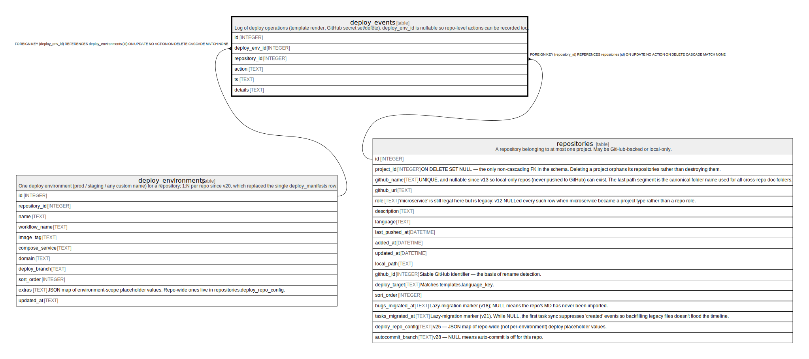

# deploy_events

## Description

Log of deploy operations (template render, GitHub secret set/delete). deploy_env_id is nullable so repo-level actions can be recorded too.

<details>
<summary><strong>Table Definition</strong></summary>

```sql
CREATE TABLE deploy_events (
             id INTEGER PRIMARY KEY AUTOINCREMENT,
             deploy_env_id INTEGER REFERENCES deploy_environments(id) ON DELETE CASCADE,
             repository_id INTEGER NOT NULL REFERENCES repositories(id) ON DELETE CASCADE,
             action TEXT NOT NULL CHECK(action IN ('render','env_secret_set','env_secret_delete')),
             ts TEXT NOT NULL,
             details TEXT
         )
```

</details>

## Columns

| Name          | Type    | Default | Nullable | Children | Parents                                       | Comment |
| ------------- | ------- | ------- | -------- | -------- | --------------------------------------------- | ------- |
| id            | INTEGER |         | true     |          |                                               |         |
| deploy_env_id | INTEGER |         | true     |          | [deploy_environments](deploy_environments.md) |         |
| repository_id | INTEGER |         | false    |          | [repositories](repositories.md)               |         |
| action        | TEXT    |         | false    |          |                                               |         |
| ts            | TEXT    |         | false    |          |                                               |         |
| details       | TEXT    |         | true     |          |                                               |         |

## Constraints

| Name                  | Type        | Definition                                                                                                       |
| --------------------- | ----------- | ---------------------------------------------------------------------------------------------------------------- |
| id                    | PRIMARY KEY | PRIMARY KEY (id)                                                                                                 |
| - (Foreign key ID: 0) | FOREIGN KEY | FOREIGN KEY (repository_id) REFERENCES repositories (id) ON UPDATE NO ACTION ON DELETE CASCADE MATCH NONE        |
| - (Foreign key ID: 1) | FOREIGN KEY | FOREIGN KEY (deploy_env_id) REFERENCES deploy_environments (id) ON UPDATE NO ACTION ON DELETE CASCADE MATCH NONE |
| -                     | CHECK       | CHECK(action IN ('render','env_secret_set','env_secret_delete'))                                                 |

## Indexes

| Name                   | Definition                                                          |
| ---------------------- | ------------------------------------------------------------------- |
| idx_deploy_events_repo | CREATE INDEX idx_deploy_events_repo ON deploy_events(repository_id) |
| idx_deploy_events_ts   | CREATE INDEX idx_deploy_events_ts ON deploy_events(ts)              |

## Relations



---

> Generated by [tbls](https://github.com/k1LoW/tbls)
