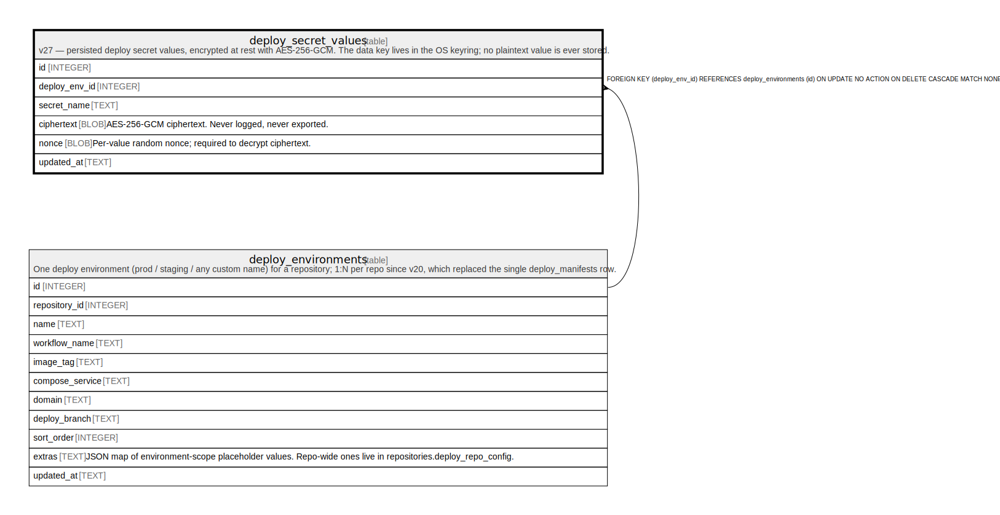

# deploy_secret_values

## Description

v27 — persisted deploy secret values, encrypted at rest with AES-256-GCM. The data key lives in the OS keyring; no plaintext value is ever stored.

<details>
<summary><strong>Table Definition</strong></summary>

```sql
CREATE TABLE deploy_secret_values (
            id            INTEGER PRIMARY KEY AUTOINCREMENT,
            deploy_env_id INTEGER NOT NULL REFERENCES deploy_environments(id) ON DELETE CASCADE,
            secret_name   TEXT NOT NULL,
            ciphertext    BLOB NOT NULL,
            nonce         BLOB NOT NULL,
            updated_at    TEXT NOT NULL,
            UNIQUE(deploy_env_id, secret_name)
        )
```

</details>

## Columns

| Name          | Type    | Default | Nullable | Children | Parents                                       | Comment                                                 |
| ------------- | ------- | ------- | -------- | -------- | --------------------------------------------- | ------------------------------------------------------- |
| id            | INTEGER |         | true     |          |                                               |                                                         |
| deploy_env_id | INTEGER |         | false    |          | [deploy_environments](deploy_environments.md) |                                                         |
| secret_name   | TEXT    |         | false    |          |                                               |                                                         |
| ciphertext    | BLOB    |         | false    |          |                                               | AES-256-GCM ciphertext. Never logged, never exported.   |
| nonce         | BLOB    |         | false    |          |                                               | Per-value random nonce; required to decrypt ciphertext. |
| updated_at    | TEXT    |         | false    |          |                                               |                                                         |

## Constraints

| Name                                    | Type        | Definition                                                                                                       |
| --------------------------------------- | ----------- | ---------------------------------------------------------------------------------------------------------------- |
| id                                      | PRIMARY KEY | PRIMARY KEY (id)                                                                                                 |
| - (Foreign key ID: 0)                   | FOREIGN KEY | FOREIGN KEY (deploy_env_id) REFERENCES deploy_environments (id) ON UPDATE NO ACTION ON DELETE CASCADE MATCH NONE |
| sqlite_autoindex_deploy_secret_values_1 | UNIQUE      | UNIQUE (deploy_env_id, secret_name)                                                                              |

## Indexes

| Name                                    | Definition                          |
| --------------------------------------- | ----------------------------------- |
| sqlite_autoindex_deploy_secret_values_1 | UNIQUE (deploy_env_id, secret_name) |

## Relations



---

> Generated by [tbls](https://github.com/k1LoW/tbls)
