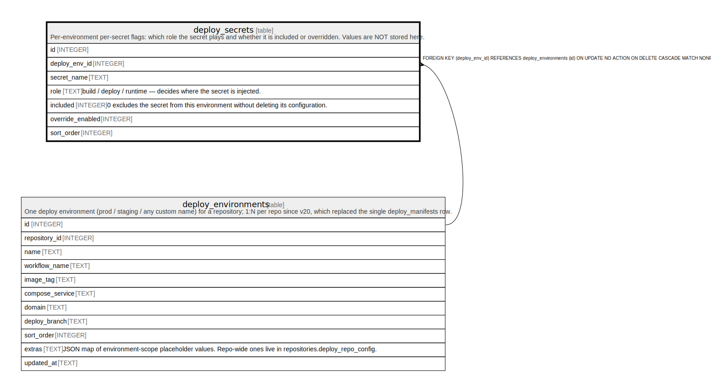

# deploy_secrets

## Description

Per-environment per-secret flags: which role the secret plays and whether it is included or overridden. Values are NOT stored here.

<details>
<summary><strong>Table Definition</strong></summary>

```sql
CREATE TABLE deploy_secrets (
            id INTEGER PRIMARY KEY AUTOINCREMENT,
            deploy_env_id INTEGER NOT NULL REFERENCES deploy_environments(id) ON DELETE CASCADE,
            secret_name TEXT NOT NULL,
            role TEXT CHECK(role IN ('build','deploy','runtime')),
            included INTEGER NOT NULL DEFAULT 1,
            override_enabled INTEGER NOT NULL DEFAULT 0,
            sort_order INTEGER NOT NULL DEFAULT 0,
            UNIQUE(deploy_env_id, secret_name)
         )
```

</details>

## Columns

| Name             | Type    | Default | Nullable | Children | Parents                                       | Comment                                                                         |
| ---------------- | ------- | ------- | -------- | -------- | --------------------------------------------- | ------------------------------------------------------------------------------- |
| id               | INTEGER |         | true     |          |                                               |                                                                                 |
| deploy_env_id    | INTEGER |         | false    |          | [deploy_environments](deploy_environments.md) |                                                                                 |
| secret_name      | TEXT    |         | false    |          |                                               |                                                                                 |
| role             | TEXT    |         | true     |          |                                               | build / deploy / runtime — decides where the secret is injected.                |
| included         | INTEGER | 1       | false    |          |                                               | 0 excludes the secret from this environment without deleting its configuration. |
| override_enabled | INTEGER | 0       | false    |          |                                               |                                                                                 |
| sort_order       | INTEGER | 0       | false    |          |                                               |                                                                                 |

## Constraints

| Name                              | Type        | Definition                                                                                                       |
| --------------------------------- | ----------- | ---------------------------------------------------------------------------------------------------------------- |
| id                                | PRIMARY KEY | PRIMARY KEY (id)                                                                                                 |
| - (Foreign key ID: 0)             | FOREIGN KEY | FOREIGN KEY (deploy_env_id) REFERENCES deploy_environments (id) ON UPDATE NO ACTION ON DELETE CASCADE MATCH NONE |
| sqlite_autoindex_deploy_secrets_1 | UNIQUE      | UNIQUE (deploy_env_id, secret_name)                                                                              |
| -                                 | CHECK       | CHECK(role IN ('build','deploy','runtime'))                                                                      |

## Indexes

| Name                              | Definition                                                           |
| --------------------------------- | -------------------------------------------------------------------- |
| idx_deploy_secrets_env            | CREATE INDEX idx_deploy_secrets_env ON deploy_secrets(deploy_env_id) |
| sqlite_autoindex_deploy_secrets_1 | UNIQUE (deploy_env_id, secret_name)                                  |

## Relations



---

> Generated by [tbls](https://github.com/k1LoW/tbls)
