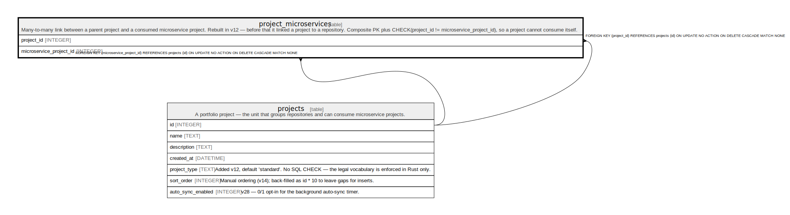

# project_microservices

## Description

Many-to-many link between a parent project and a consumed microservice project. Rebuilt in v12 — before that it linked a project to a repository. Composite PK plus CHECK(project_id != microservice_project_id), so a project cannot consume itself.

<details>
<summary><strong>Table Definition</strong></summary>

```sql
CREATE TABLE "project_microservices" (
            project_id INTEGER NOT NULL REFERENCES projects(id) ON DELETE CASCADE,
            microservice_project_id INTEGER NOT NULL REFERENCES projects(id) ON DELETE CASCADE,
            PRIMARY KEY (project_id, microservice_project_id),
            CHECK (project_id != microservice_project_id)
         )
```

</details>

## Columns

| Name                    | Type    | Default | Nullable | Children | Parents                 | Comment |
| ----------------------- | ------- | ------- | -------- | -------- | ----------------------- | ------- |
| project_id              | INTEGER |         | false    |          | [projects](projects.md) |         |
| microservice_project_id | INTEGER |         | false    |          | [projects](projects.md) |         |

## Constraints

| Name                                     | Type        | Definition                                                                                                      |
| ---------------------------------------- | ----------- | --------------------------------------------------------------------------------------------------------------- |
| project_id                               | PRIMARY KEY | PRIMARY KEY (project_id)                                                                                        |
| microservice_project_id                  | PRIMARY KEY | PRIMARY KEY (microservice_project_id)                                                                           |
| - (Foreign key ID: 0)                    | FOREIGN KEY | FOREIGN KEY (microservice_project_id) REFERENCES projects (id) ON UPDATE NO ACTION ON DELETE CASCADE MATCH NONE |
| - (Foreign key ID: 1)                    | FOREIGN KEY | FOREIGN KEY (project_id) REFERENCES projects (id) ON UPDATE NO ACTION ON DELETE CASCADE MATCH NONE              |
| sqlite_autoindex_project_microservices_1 | PRIMARY KEY | PRIMARY KEY (project_id, microservice_project_id)                                                               |
| -                                        | CHECK       | CHECK (project_id != microservice_project_id)                                                                   |

## Indexes

| Name                                     | Definition                                        |
| ---------------------------------------- | ------------------------------------------------- |
| sqlite_autoindex_project_microservices_1 | PRIMARY KEY (project_id, microservice_project_id) |

## Relations



---

> Generated by [tbls](https://github.com/k1LoW/tbls)
