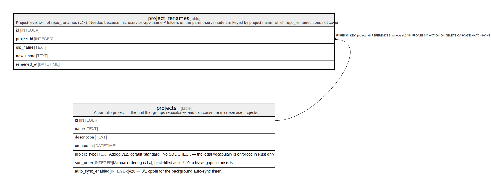

# project_renames

## Description

Project-level twin of repo_renames (v24). Needed because microservice-api/<name>/ folders on the parent-server side are keyed by project name, which repo_renames does not cover.

<details>
<summary><strong>Table Definition</strong></summary>

```sql
CREATE TABLE project_renames (
            id INTEGER PRIMARY KEY AUTOINCREMENT,
            project_id INTEGER NOT NULL REFERENCES projects(id) ON DELETE CASCADE,
            old_name TEXT NOT NULL,
            new_name TEXT NOT NULL,
            renamed_at DATETIME NOT NULL DEFAULT CURRENT_TIMESTAMP
         )
```

</details>

## Columns

| Name       | Type     | Default           | Nullable | Children | Parents                 | Comment |
| ---------- | -------- | ----------------- | -------- | -------- | ----------------------- | ------- |
| id         | INTEGER  |                   | true     |          |                         |         |
| project_id | INTEGER  |                   | false    |          | [projects](projects.md) |         |
| old_name   | TEXT     |                   | false    |          |                         |         |
| new_name   | TEXT     |                   | false    |          |                         |         |
| renamed_at | DATETIME | CURRENT_TIMESTAMP | false    |          |                         |         |

## Constraints

| Name                  | Type        | Definition                                                                                         |
| --------------------- | ----------- | -------------------------------------------------------------------------------------------------- |
| id                    | PRIMARY KEY | PRIMARY KEY (id)                                                                                   |
| - (Foreign key ID: 0) | FOREIGN KEY | FOREIGN KEY (project_id) REFERENCES projects (id) ON UPDATE NO ACTION ON DELETE CASCADE MATCH NONE |

## Indexes

| Name                        | Definition                                                              |
| --------------------------- | ----------------------------------------------------------------------- |
| idx_project_renames_project | CREATE INDEX idx_project_renames_project ON project_renames(project_id) |

## Relations



---

> Generated by [tbls](https://github.com/k1LoW/tbls)
