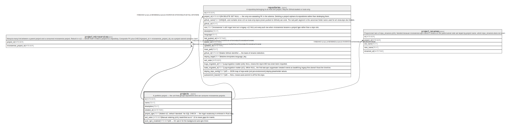

# projects

## Description

A portfolio project — the unit that groups repositories and can consume microservice projects.

<details>
<summary><strong>Table Definition</strong></summary>

```sql
CREATE TABLE projects (
            id INTEGER PRIMARY KEY AUTOINCREMENT,
            name TEXT NOT NULL,
            description TEXT,
            created_at DATETIME DEFAULT CURRENT_TIMESTAMP
        , project_type TEXT NOT NULL DEFAULT 'standard', sort_order INTEGER NOT NULL DEFAULT 0, auto_sync_enabled INTEGER NOT NULL DEFAULT 0)
```

</details>

## Columns

| Name              | Type     | Default           | Nullable | Children                                                                                                                | Parents | Comment                                                                                      |
| ----------------- | -------- | ----------------- | -------- | ----------------------------------------------------------------------------------------------------------------------- | ------- | -------------------------------------------------------------------------------------------- |
| id                | INTEGER  |                   | true     | [project_microservices](project_microservices.md) [repositories](repositories.md) [project_renames](project_renames.md) |         |                                                                                              |
| name              | TEXT     |                   | false    |                                                                                                                         |         |                                                                                              |
| description       | TEXT     |                   | true     |                                                                                                                         |         |                                                                                              |
| created_at        | DATETIME | CURRENT_TIMESTAMP | true     |                                                                                                                         |         |                                                                                              |
| project_type      | TEXT     | 'standard'        | false    |                                                                                                                         |         | Added v12, default 'standard'. No SQL CHECK — the legal vocabulary is enforced in Rust only. |
| sort_order        | INTEGER  | 0                 | false    |                                                                                                                         |         | Manual ordering (v14); back-filled as id * 10 to leave gaps for inserts.                     |
| auto_sync_enabled | INTEGER  | 0                 | false    |                                                                                                                         |         | v28 — 0/1 opt-in for the background auto-sync timer.                                         |

## Constraints

| Name | Type        | Definition       |
| ---- | ----------- | ---------------- |
| id   | PRIMARY KEY | PRIMARY KEY (id) |

## Relations



---

> Generated by [tbls](https://github.com/k1LoW/tbls)
