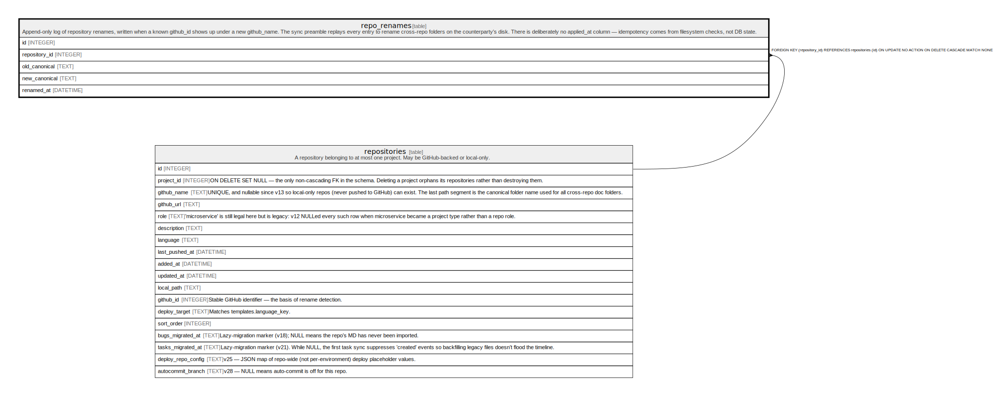

# repo_renames

## Description

Append-only log of repository renames, written when a known github_id shows up under a new github_name. The sync preamble replays every entry to rename cross-repo folders on the counterparty's disk. There is deliberately no applied_at column — idempotency comes from filesystem checks, not DB state.

<details>
<summary><strong>Table Definition</strong></summary>

```sql
CREATE TABLE repo_renames (
            id INTEGER PRIMARY KEY AUTOINCREMENT,
            repository_id INTEGER NOT NULL REFERENCES repositories(id) ON DELETE CASCADE,
            old_canonical TEXT NOT NULL,
            new_canonical TEXT NOT NULL,
            renamed_at DATETIME NOT NULL DEFAULT CURRENT_TIMESTAMP
         )
```

</details>

## Columns

| Name          | Type     | Default           | Nullable | Children | Parents                         | Comment |
| ------------- | -------- | ----------------- | -------- | -------- | ------------------------------- | ------- |
| id            | INTEGER  |                   | true     |          |                                 |         |
| repository_id | INTEGER  |                   | false    |          | [repositories](repositories.md) |         |
| old_canonical | TEXT     |                   | false    |          |                                 |         |
| new_canonical | TEXT     |                   | false    |          |                                 |         |
| renamed_at    | DATETIME | CURRENT_TIMESTAMP | false    |          |                                 |         |

## Constraints

| Name                  | Type        | Definition                                                                                                |
| --------------------- | ----------- | --------------------------------------------------------------------------------------------------------- |
| id                    | PRIMARY KEY | PRIMARY KEY (id)                                                                                          |
| - (Foreign key ID: 0) | FOREIGN KEY | FOREIGN KEY (repository_id) REFERENCES repositories (id) ON UPDATE NO ACTION ON DELETE CASCADE MATCH NONE |

## Indexes

| Name                  | Definition                                                        |
| --------------------- | ----------------------------------------------------------------- |
| idx_repo_renames_repo | CREATE INDEX idx_repo_renames_repo ON repo_renames(repository_id) |

## Relations



---

> Generated by [tbls](https://github.com/k1LoW/tbls)
