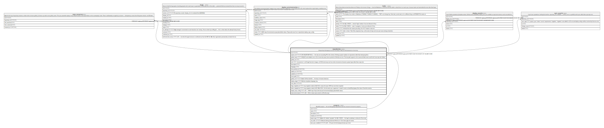

# repositories

## Description

A repository belonging to at most one project. May be GitHub-backed or local-only.

<details>
<summary><strong>Table Definition</strong></summary>

```sql
CREATE TABLE "repositories" (
            id INTEGER PRIMARY KEY AUTOINCREMENT,
            project_id INTEGER REFERENCES projects(id) ON DELETE SET NULL,
            github_name TEXT UNIQUE,
            github_url TEXT,
            role TEXT CHECK(role IN ('server','client','test_client','admin_client','microservice','landing','tool','other')),
            description TEXT,
            language TEXT,
            last_pushed_at DATETIME,
            added_at DATETIME DEFAULT CURRENT_TIMESTAMP,
            updated_at DATETIME DEFAULT CURRENT_TIMESTAMP,
            local_path TEXT,
            github_id INTEGER,
            deploy_target TEXT
         , sort_order INTEGER NOT NULL DEFAULT 0, bugs_migrated_at TEXT, tasks_migrated_at TEXT, deploy_repo_config TEXT NOT NULL DEFAULT '{}', autocommit_branch TEXT)
```

</details>

## Columns

| Name               | Type     | Default           | Nullable | Children                                                                                                                                                                        | Parents                 | Comment                                                                                                                                                                        |
| ------------------ | -------- | ----------------- | -------- | ------------------------------------------------------------------------------------------------------------------------------------------------------------------------------- | ----------------------- | ------------------------------------------------------------------------------------------------------------------------------------------------------------------------------ |
| id                 | INTEGER  |                   | true     | [repo_renames](repo_renames.md) [bugs](bugs.md) [deploy_environments](deploy_environments.md) [tasks](tasks.md) [deploy_events](deploy_events.md) [sync_events](sync_events.md) |                         |                                                                                                                                                                                |
| project_id         | INTEGER  |                   | true     |                                                                                                                                                                                 | [projects](projects.md) | ON DELETE SET NULL — the only non-cascading FK in the schema. Deleting a project orphans its repositories rather than destroying them.                                         |
| github_name        | TEXT     |                   | true     |                                                                                                                                                                                 |                         | UNIQUE, and nullable since v13 so local-only repos (never pushed to GitHub) can exist. The last path segment is the canonical folder name used for all cross-repo doc folders. |
| github_url         | TEXT     |                   | true     |                                                                                                                                                                                 |                         |                                                                                                                                                                                |
| role               | TEXT     |                   | true     |                                                                                                                                                                                 |                         | 'microservice' is still legal here but is legacy: v12 NULLed every such row when microservice became a project type rather than a repo role.                                   |
| description        | TEXT     |                   | true     |                                                                                                                                                                                 |                         |                                                                                                                                                                                |
| language           | TEXT     |                   | true     |                                                                                                                                                                                 |                         |                                                                                                                                                                                |
| last_pushed_at     | DATETIME |                   | true     |                                                                                                                                                                                 |                         |                                                                                                                                                                                |
| added_at           | DATETIME | CURRENT_TIMESTAMP | true     |                                                                                                                                                                                 |                         |                                                                                                                                                                                |
| updated_at         | DATETIME | CURRENT_TIMESTAMP | true     |                                                                                                                                                                                 |                         |                                                                                                                                                                                |
| local_path         | TEXT     |                   | true     |                                                                                                                                                                                 |                         |                                                                                                                                                                                |
| github_id          | INTEGER  |                   | true     |                                                                                                                                                                                 |                         | Stable GitHub identifier — the basis of rename detection.                                                                                                                      |
| deploy_target      | TEXT     |                   | true     |                                                                                                                                                                                 |                         | Matches templates.language_key.                                                                                                                                                |
| sort_order         | INTEGER  | 0                 | false    |                                                                                                                                                                                 |                         |                                                                                                                                                                                |
| bugs_migrated_at   | TEXT     |                   | true     |                                                                                                                                                                                 |                         | Lazy-migration marker (v18); NULL means the repo's MD has never been imported.                                                                                                 |
| tasks_migrated_at  | TEXT     |                   | true     |                                                                                                                                                                                 |                         | Lazy-migration marker (v21). While NULL, the first task sync suppresses 'created' events so backfilling legacy files doesn't flood the timeline.                               |
| deploy_repo_config | TEXT     | '{}'              | false    |                                                                                                                                                                                 |                         | v25 — JSON map of repo-wide (not per-environment) deploy placeholder values.                                                                                                   |
| autocommit_branch  | TEXT     |                   | true     |                                                                                                                                                                                 |                         | v28 — NULL means auto-commit is off for this repo.                                                                                                                             |

## Constraints

| Name                            | Type        | Definition                                                                                              |
| ------------------------------- | ----------- | ------------------------------------------------------------------------------------------------------- |
| id                              | PRIMARY KEY | PRIMARY KEY (id)                                                                                        |
| - (Foreign key ID: 0)           | FOREIGN KEY | FOREIGN KEY (project_id) REFERENCES projects (id) ON UPDATE NO ACTION ON DELETE SET NULL MATCH NONE     |
| sqlite_autoindex_repositories_1 | UNIQUE      | UNIQUE (github_name)                                                                                    |
| -                               | CHECK       | CHECK(role IN ('server','client','test_client','admin_client','microservice','landing','tool','other')) |

## Indexes

| Name                            | Definition           |
| ------------------------------- | -------------------- |
| sqlite_autoindex_repositories_1 | UNIQUE (github_name) |

## Relations



---

> Generated by [tbls](https://github.com/k1LoW/tbls)
