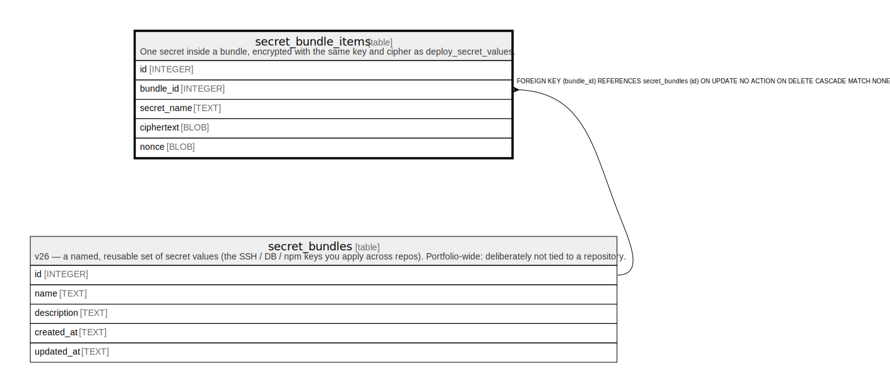

# secret_bundle_items

## Description

One secret inside a bundle, encrypted with the same key and cipher as deploy_secret_values.

<details>
<summary><strong>Table Definition</strong></summary>

```sql
CREATE TABLE secret_bundle_items (
            id          INTEGER PRIMARY KEY AUTOINCREMENT,
            bundle_id   INTEGER NOT NULL REFERENCES secret_bundles(id) ON DELETE CASCADE,
            secret_name TEXT NOT NULL,
            ciphertext  BLOB NOT NULL,
            nonce       BLOB NOT NULL,
            UNIQUE(bundle_id, secret_name)
        )
```

</details>

## Columns

| Name        | Type    | Default | Nullable | Children | Parents                             | Comment |
| ----------- | ------- | ------- | -------- | -------- | ----------------------------------- | ------- |
| id          | INTEGER |         | true     |          |                                     |         |
| bundle_id   | INTEGER |         | false    |          | [secret_bundles](secret_bundles.md) |         |
| secret_name | TEXT    |         | false    |          |                                     |         |
| ciphertext  | BLOB    |         | false    |          |                                     |         |
| nonce       | BLOB    |         | false    |          |                                     |         |

## Constraints

| Name                                   | Type        | Definition                                                                                              |
| -------------------------------------- | ----------- | ------------------------------------------------------------------------------------------------------- |
| id                                     | PRIMARY KEY | PRIMARY KEY (id)                                                                                        |
| - (Foreign key ID: 0)                  | FOREIGN KEY | FOREIGN KEY (bundle_id) REFERENCES secret_bundles (id) ON UPDATE NO ACTION ON DELETE CASCADE MATCH NONE |
| sqlite_autoindex_secret_bundle_items_1 | UNIQUE      | UNIQUE (bundle_id, secret_name)                                                                         |

## Indexes

| Name                                   | Definition                      |
| -------------------------------------- | ------------------------------- |
| sqlite_autoindex_secret_bundle_items_1 | UNIQUE (bundle_id, secret_name) |

## Relations



---

> Generated by [tbls](https://github.com/k1LoW/tbls)
