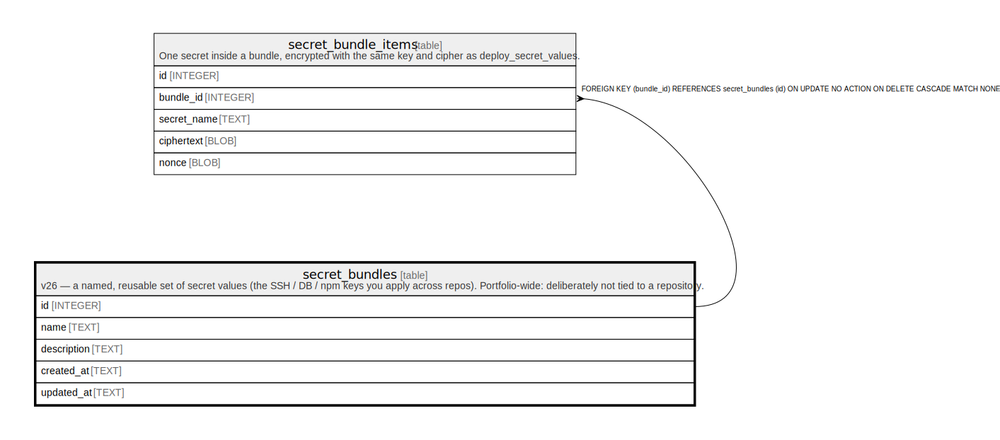

# secret_bundles

## Description

v26 — a named, reusable set of secret values (the SSH / DB / npm keys you apply across repos). Portfolio-wide: deliberately not tied to a repository.

<details>
<summary><strong>Table Definition</strong></summary>

```sql
CREATE TABLE secret_bundles (
            id          INTEGER PRIMARY KEY AUTOINCREMENT,
            name        TEXT NOT NULL UNIQUE,
            description TEXT NOT NULL DEFAULT '',
            created_at  TEXT NOT NULL,
            updated_at  TEXT NOT NULL
        )
```

</details>

## Columns

| Name        | Type    | Default | Nullable | Children                                      | Parents | Comment |
| ----------- | ------- | ------- | -------- | --------------------------------------------- | ------- | ------- |
| id          | INTEGER |         | true     | [secret_bundle_items](secret_bundle_items.md) |         |         |
| name        | TEXT    |         | false    |                                               |         |         |
| description | TEXT    | ''      | false    |                                               |         |         |
| created_at  | TEXT    |         | false    |                                               |         |         |
| updated_at  | TEXT    |         | false    |                                               |         |         |

## Constraints

| Name                              | Type        | Definition       |
| --------------------------------- | ----------- | ---------------- |
| id                                | PRIMARY KEY | PRIMARY KEY (id) |
| sqlite_autoindex_secret_bundles_1 | UNIQUE      | UNIQUE (name)    |

## Indexes

| Name                              | Definition    |
| --------------------------------- | ------------- |
| sqlite_autoindex_secret_bundles_1 | UNIQUE (name) |

## Relations



---

> Generated by [tbls](https://github.com/k1LoW/tbls)
