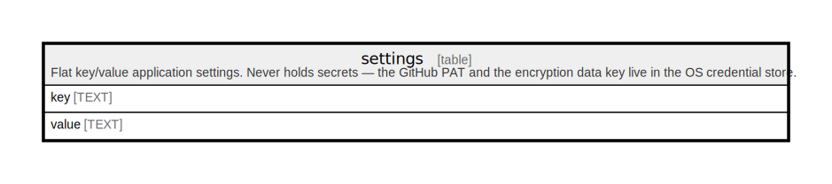

# settings

## Description

Flat key/value application settings. Never holds secrets — the GitHub PAT and the encryption data key live in the OS credential store.

<details>
<summary><strong>Table Definition</strong></summary>

```sql
CREATE TABLE settings (
            key TEXT PRIMARY KEY,
            value TEXT
        )
```

</details>

## Columns

| Name  | Type | Default | Nullable | Children | Parents | Comment |
| ----- | ---- | ------- | -------- | -------- | ------- | ------- |
| key   | TEXT |         | true     |          |         |         |
| value | TEXT |         | true     |          |         |         |

## Constraints

| Name                        | Type        | Definition        |
| --------------------------- | ----------- | ----------------- |
| key                         | PRIMARY KEY | PRIMARY KEY (key) |
| sqlite_autoindex_settings_1 | PRIMARY KEY | PRIMARY KEY (key) |

## Indexes

| Name                        | Definition        |
| --------------------------- | ----------------- |
| sqlite_autoindex_settings_1 | PRIMARY KEY (key) |

## Relations



---

> Generated by [tbls](https://github.com/k1LoW/tbls)
