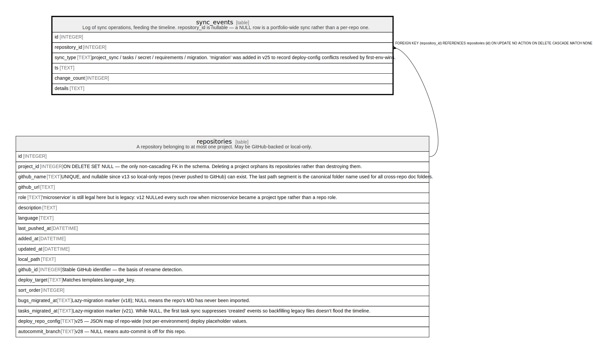

# sync_events

## Description

Log of sync operations, feeding the timeline. repository_id is nullable — a NULL row is a portfolio-wide sync rather than a per-repo one.

<details>
<summary><strong>Table Definition</strong></summary>

```sql
CREATE TABLE "sync_events" (
             id INTEGER PRIMARY KEY AUTOINCREMENT,
             repository_id INTEGER REFERENCES repositories(id) ON DELETE CASCADE,
             sync_type TEXT NOT NULL CHECK(sync_type IN ('project_sync','tasks','secret','requirements','migration')),
             ts TEXT NOT NULL,
             change_count INTEGER NOT NULL DEFAULT 0,
             details TEXT
         )
```

</details>

## Columns

| Name          | Type    | Default | Nullable | Children | Parents                         | Comment                                                                                                                                              |
| ------------- | ------- | ------- | -------- | -------- | ------------------------------- | ---------------------------------------------------------------------------------------------------------------------------------------------------- |
| id            | INTEGER |         | true     |          |                                 |                                                                                                                                                      |
| repository_id | INTEGER |         | true     |          | [repositories](repositories.md) |                                                                                                                                                      |
| sync_type     | TEXT    |         | false    |          |                                 | project_sync / tasks / secret / requirements / migration. 'migration' was added in v25 to record deploy-config conflicts resolved by first-env-wins. |
| ts            | TEXT    |         | false    |          |                                 |                                                                                                                                                      |
| change_count  | INTEGER | 0       | false    |          |                                 |                                                                                                                                                      |
| details       | TEXT    |         | true     |          |                                 |                                                                                                                                                      |

## Constraints

| Name                  | Type        | Definition                                                                                                |
| --------------------- | ----------- | --------------------------------------------------------------------------------------------------------- |
| id                    | PRIMARY KEY | PRIMARY KEY (id)                                                                                          |
| - (Foreign key ID: 0) | FOREIGN KEY | FOREIGN KEY (repository_id) REFERENCES repositories (id) ON UPDATE NO ACTION ON DELETE CASCADE MATCH NONE |
| -                     | CHECK       | CHECK(sync_type IN ('project_sync','tasks','secret','requirements','migration'))                          |

## Indexes

| Name                 | Definition                                                      |
| -------------------- | --------------------------------------------------------------- |
| idx_sync_events_repo | CREATE INDEX idx_sync_events_repo ON sync_events(repository_id) |
| idx_sync_events_ts   | CREATE INDEX idx_sync_events_ts ON sync_events(ts)              |

## Relations



---

> Generated by [tbls](https://github.com/k1LoW/tbls)
