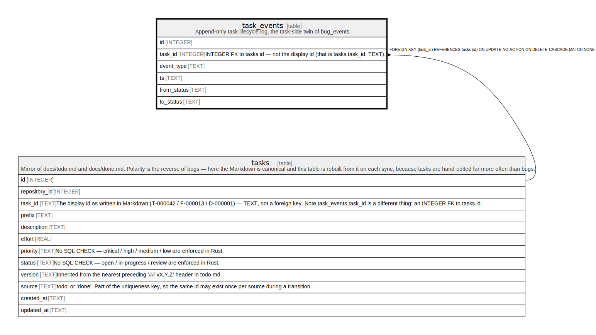

# task_events

## Description

Append-only task lifecycle log, the task-side twin of bug_events.

<details>
<summary><strong>Table Definition</strong></summary>

```sql
CREATE TABLE task_events (
             id INTEGER PRIMARY KEY AUTOINCREMENT,
             task_id INTEGER NOT NULL REFERENCES tasks(id) ON DELETE CASCADE,
             event_type TEXT NOT NULL CHECK(event_type IN (
                 'created','taken','review','done','reopened'
             )),
             ts TEXT NOT NULL,
             from_status TEXT,
             to_status TEXT
         )
```

</details>

## Columns

| Name        | Type    | Default | Nullable | Children | Parents           | Comment                                                                    |
| ----------- | ------- | ------- | -------- | -------- | ----------------- | -------------------------------------------------------------------------- |
| id          | INTEGER |         | true     |          |                   |                                                                            |
| task_id     | INTEGER |         | false    |          | [tasks](tasks.md) | INTEGER FK to tasks.id — not the display id (that is tasks.task_id, TEXT). |
| event_type  | TEXT    |         | false    |          |                   |                                                                            |
| ts          | TEXT    |         | false    |          |                   |                                                                            |
| from_status | TEXT    |         | true     |          |                   |                                                                            |
| to_status   | TEXT    |         | true     |          |                   |                                                                            |

## Constraints

| Name                  | Type        | Definition                                                                                   |
| --------------------- | ----------- | -------------------------------------------------------------------------------------------- |
| id                    | PRIMARY KEY | PRIMARY KEY (id)                                                                             |
| - (Foreign key ID: 0) | FOREIGN KEY | FOREIGN KEY (task_id) REFERENCES tasks (id) ON UPDATE NO ACTION ON DELETE CASCADE MATCH NONE |
| -                     | CHECK       | CHECK(event_type IN ( 'created','taken','review','done','reopened' ))                        |

## Indexes

| Name                    | Definition                                                          |
| ----------------------- | ------------------------------------------------------------------- |
| idx_task_events_type_ts | CREATE INDEX idx_task_events_type_ts ON task_events(event_type, ts) |
| idx_task_events_ts      | CREATE INDEX idx_task_events_ts ON task_events(ts)                  |
| idx_task_events_task    | CREATE INDEX idx_task_events_task ON task_events(task_id)           |

## Relations



---

> Generated by [tbls](https://github.com/k1LoW/tbls)
