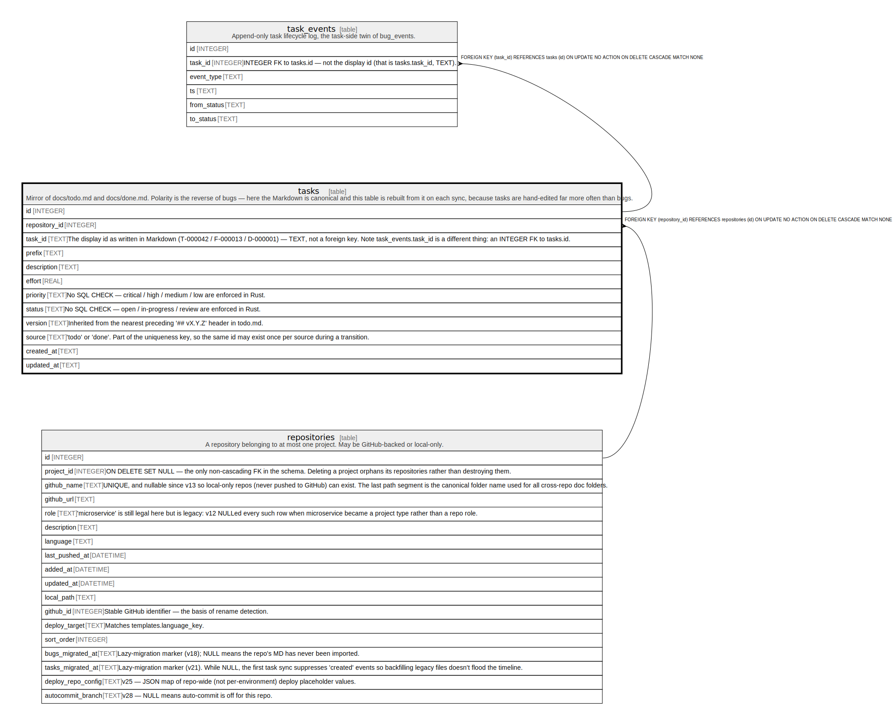

# tasks

## Description

Mirror of docs/todo.md and docs/done.md. Polarity is the reverse of bugs — here the Markdown is canonical and this table is rebuilt from it on each sync, because tasks are hand-edited far more often than bugs.

<details>
<summary><strong>Table Definition</strong></summary>

```sql
CREATE TABLE tasks (
             id INTEGER PRIMARY KEY AUTOINCREMENT,
             repository_id INTEGER NOT NULL REFERENCES repositories(id) ON DELETE CASCADE,
             task_id TEXT NOT NULL,
             prefix TEXT NOT NULL CHECK(prefix IN ('T','F','D')),
             description TEXT NOT NULL,
             effort REAL,
             priority TEXT,
             status TEXT,
             version TEXT,
             source TEXT NOT NULL CHECK(source IN ('todo','done')),
             created_at TEXT NOT NULL,
             updated_at TEXT NOT NULL,
             UNIQUE(repository_id, task_id, source)
         )
```

</details>

## Columns

| Name          | Type    | Default | Nullable | Children                      | Parents                         | Comment                                                                                                                                                                     |
| ------------- | ------- | ------- | -------- | ----------------------------- | ------------------------------- | --------------------------------------------------------------------------------------------------------------------------------------------------------------------------- |
| id            | INTEGER |         | true     | [task_events](task_events.md) |                                 |                                                                                                                                                                             |
| repository_id | INTEGER |         | false    |                               | [repositories](repositories.md) |                                                                                                                                                                             |
| task_id       | TEXT    |         | false    |                               |                                 | The display id as written in Markdown (T-000042 / F-000013 / D-000001) — TEXT, not a foreign key. Note task_events.task_id is a different thing: an INTEGER FK to tasks.id. |
| prefix        | TEXT    |         | false    |                               |                                 |                                                                                                                                                                             |
| description   | TEXT    |         | false    |                               |                                 |                                                                                                                                                                             |
| effort        | REAL    |         | true     |                               |                                 |                                                                                                                                                                             |
| priority      | TEXT    |         | true     |                               |                                 | No SQL CHECK — critical / high / medium / low are enforced in Rust.                                                                                                         |
| status        | TEXT    |         | true     |                               |                                 | No SQL CHECK — open / in-progress / review are enforced in Rust.                                                                                                            |
| version       | TEXT    |         | true     |                               |                                 | Inherited from the nearest preceding '## vX.Y.Z' header in todo.md.                                                                                                         |
| source        | TEXT    |         | false    |                               |                                 | 'todo' or 'done'. Part of the uniqueness key, so the same id may exist once per source during a transition.                                                                 |
| created_at    | TEXT    |         | false    |                               |                                 |                                                                                                                                                                             |
| updated_at    | TEXT    |         | false    |                               |                                 |                                                                                                                                                                             |

## Constraints

| Name                     | Type        | Definition                                                                                                |
| ------------------------ | ----------- | --------------------------------------------------------------------------------------------------------- |
| id                       | PRIMARY KEY | PRIMARY KEY (id)                                                                                          |
| - (Foreign key ID: 0)    | FOREIGN KEY | FOREIGN KEY (repository_id) REFERENCES repositories (id) ON UPDATE NO ACTION ON DELETE CASCADE MATCH NONE |
| sqlite_autoindex_tasks_1 | UNIQUE      | UNIQUE (repository_id, task_id, source)                                                                   |
| -                        | CHECK       | CHECK(prefix IN ('T','F','D'))                                                                            |
| -                        | CHECK       | CHECK(source IN ('todo','done'))                                                                          |

## Indexes

| Name                     | Definition                                                              |
| ------------------------ | ----------------------------------------------------------------------- |
| idx_tasks_status         | CREATE INDEX idx_tasks_status ON tasks(status) WHERE status IS NOT NULL |
| idx_tasks_repo_source    | CREATE INDEX idx_tasks_repo_source ON tasks(repository_id, source)      |
| idx_tasks_repo           | CREATE INDEX idx_tasks_repo ON tasks(repository_id)                     |
| sqlite_autoindex_tasks_1 | UNIQUE (repository_id, task_id, source)                                 |

## Relations



---

> Generated by [tbls](https://github.com/k1LoW/tbls)
