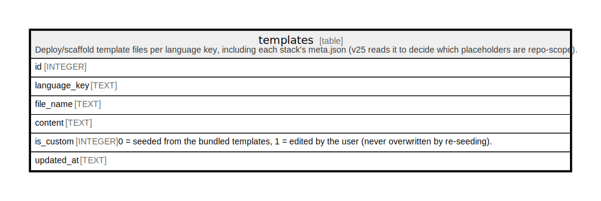

# templates

## Description

Deploy/scaffold template files per language key, including each stack's meta.json (v25 reads it to decide which placeholders are repo-scope).

<details>
<summary><strong>Table Definition</strong></summary>

```sql
CREATE TABLE templates (
            id INTEGER PRIMARY KEY AUTOINCREMENT,
            language_key TEXT NOT NULL,
            file_name TEXT NOT NULL,
            content TEXT NOT NULL,
            is_custom INTEGER NOT NULL DEFAULT 0,
            updated_at TEXT NOT NULL DEFAULT CURRENT_TIMESTAMP,
            UNIQUE(language_key, file_name)
         )
```

</details>

## Columns

| Name         | Type    | Default           | Nullable | Children | Parents | Comment                                                                                          |
| ------------ | ------- | ----------------- | -------- | -------- | ------- | ------------------------------------------------------------------------------------------------ |
| id           | INTEGER |                   | true     |          |         |                                                                                                  |
| language_key | TEXT    |                   | false    |          |         |                                                                                                  |
| file_name    | TEXT    |                   | false    |          |         |                                                                                                  |
| content      | TEXT    |                   | false    |          |         |                                                                                                  |
| is_custom    | INTEGER | 0                 | false    |          |         | 0 = seeded from the bundled templates, 1 = edited by the user (never overwritten by re-seeding). |
| updated_at   | TEXT    | CURRENT_TIMESTAMP | false    |          |         |                                                                                                  |

## Constraints

| Name                         | Type        | Definition                       |
| ---------------------------- | ----------- | -------------------------------- |
| id                           | PRIMARY KEY | PRIMARY KEY (id)                 |
| sqlite_autoindex_templates_1 | UNIQUE      | UNIQUE (language_key, file_name) |

## Indexes

| Name                         | Definition                       |
| ---------------------------- | -------------------------------- |
| sqlite_autoindex_templates_1 | UNIQUE (language_key, file_name) |

## Relations



---

> Generated by [tbls](https://github.com/k1LoW/tbls)
